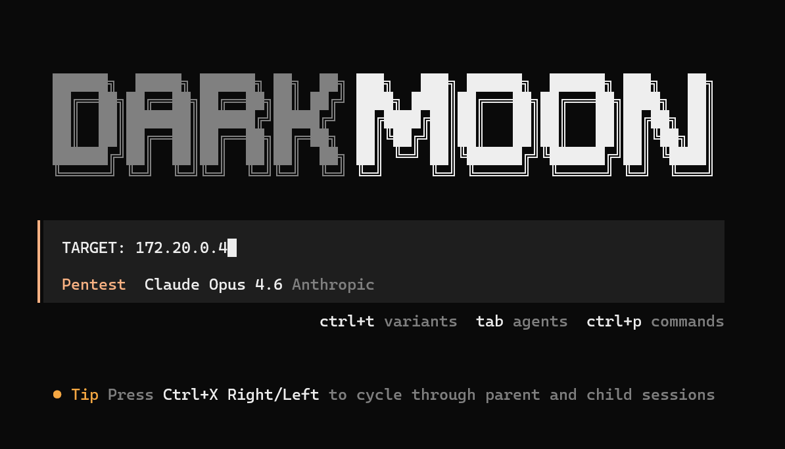
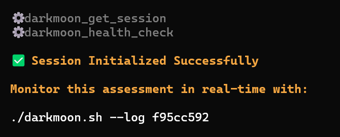
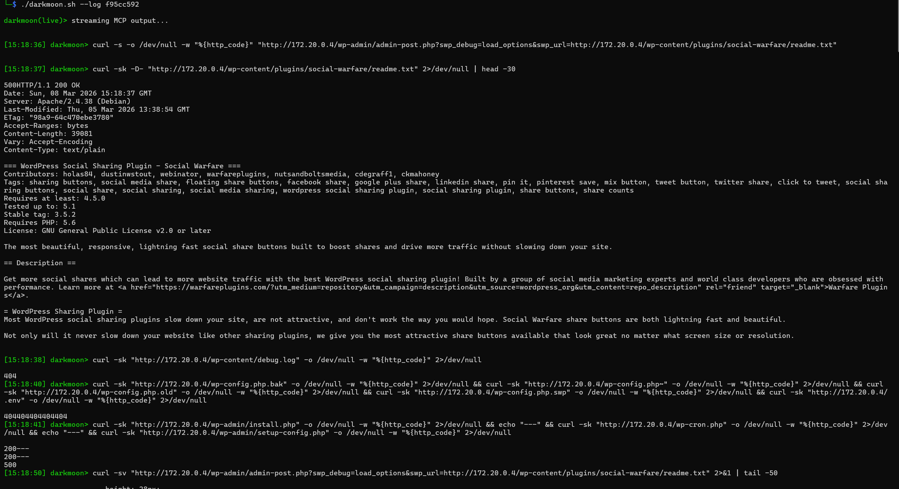
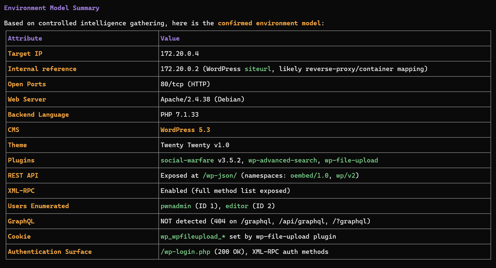
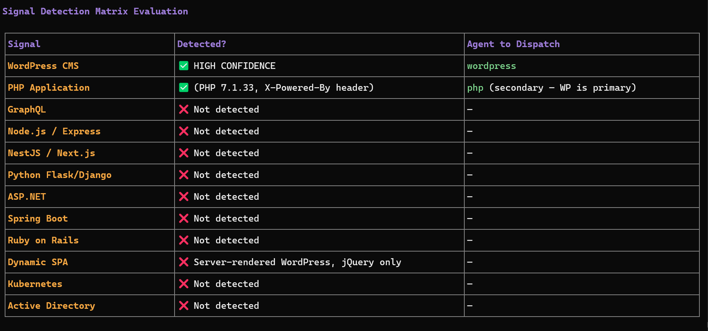
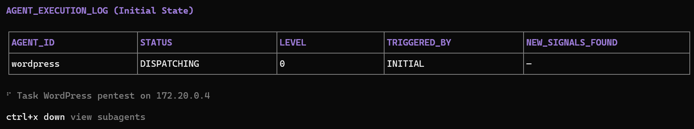
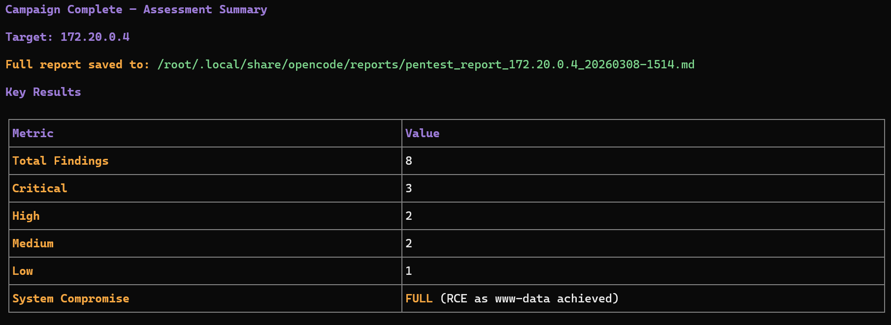
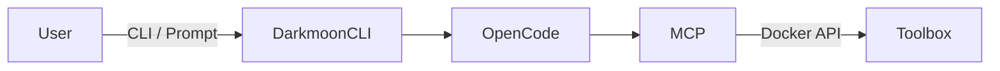
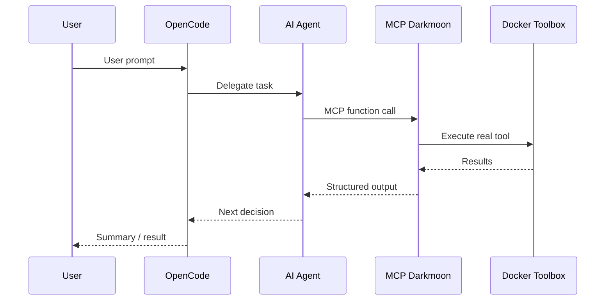
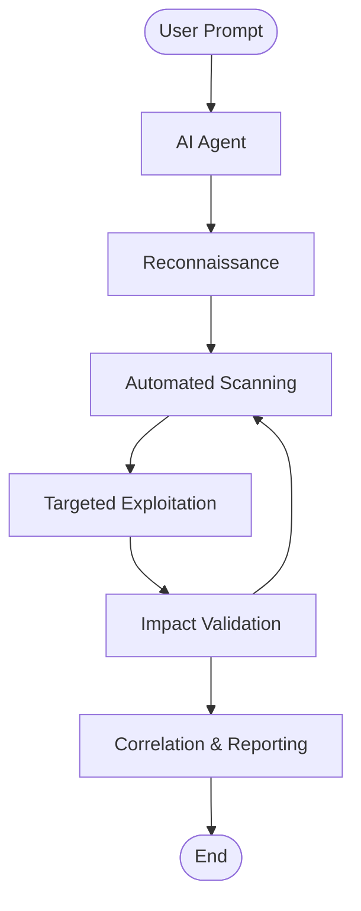

<center>


A platform that allows you to conduct a complete penetration testing campaign

</center>

# Summary

- [I. Preview](#i-preview)
- [II. Installation](#ii-installation)
  - [II.1. Prerequisites](#ii1-prerequisites)
  - [II.2. General project structure](#ii2-general-project-structure)
  - [II.3. Configuration of environment variables in docker compose](#ii3-configuration-of-environment-variables-in-docker-compose)
    - [II.3.a Example environment variable](#ii3a-example-environment-variable)
    - [II.3.b Role of the variables](#ii3b-role-of-the-variables)
  - [II.4. Automatic generation of OpenCode files](#ii4-automatic-generation-of-opencode-files)
  - [II.5. Volumes and persistence](#ii5-volumes-and-persistence)
    - [II.5.a Important volumes](#ii5a-important-volumes)
    - [II.5.b What this allows](#ii5b-what-this-allows)
  - [II.6. Build and launch Darkmoon](#ii6-build-and-launch-darkmoon)
    - [II.6.a Building the images](#ii6a-building-the-images)
    - [II.6.b Launching the stack](#ii6b-launching-the-stack)
  - [II.7. Launch Darkmoon (User CLI)](#ii7-launch-darkmoon-user-cli)
    - [II.7.a Make the wrapper executable](#ii7a-make-the-wrapper-executable)
    - [II.7.b Install globally (optional)](#ii7b-install-globally-optional)
    - [II.7.c Launch Darkmoon with TUI Console](#ii7c-launch-darkmoon-with-tui-console)
    - [II.7.d View logs](#ii7d-view-logs)
  - [II.8. Direct access to the container (debug)](#ii8-direct-access-to-the-container-debug)
  - [II.9. Where to modify what (summary)](#ii9-where-to-modify-what-summary)
  - [II.10. Quick summary](#ii10-quick-summary)
- [III. Uses](#iii-uses)
  - [III.1. Prompt Examples](#iii1-prompt-examples)
- [IV. Architecture](#iv-architecture)
  - [IV.1. Core Idea](#iv1-core-idea)
  - [IV.2. Main Components (Who Does What)](#iv2-main-components-who-does-what)
    - [IV.2.a. OpenCode — The Brain](#iv2a-opencode--the-brain)
    - [IV.2.b. AI Agents — The Strategy Layer](#iv2b-ai-agents--the-strategy-layer)
    - [IV.2.c. MCP Darkmoon — The Security Gatekeeper](#iv2c-mcp-darkmoon--the-security-gatekeeper)
    - [IV.2.d. Darkmoon Toolbox — The Real Tools](#iv2d-darkmoon-toolbox--the-real-tools)
    - [IV.2.e. Docker \& Volumes — Isolation and Persistence](#iv2e-docker--volumes--isolation-and-persistence)
  - [IV.3. Execution Flow (Simple Overview)](#iv3-execution-flow-simple-overview)
    - [IV.3.a Deployment diagram](#iv3a-deployment-diagram)
    - [IV.3.b Network flow diagram](#iv3b-network-flow-diagram)
    - [IV.3.c Activity diagram — End-to-end penetration testing](#iv3c-activity-diagram--end-to-end-penetration-testing)
  - [IV.4. Security by Design](#iv4-security-by-design)
  - [IV.5. Why This Architecture Is Robust](#iv5-why-this-architecture-is-robust)
- [V. AI Agents](#v-ai-agents)
  - [V.1. What is a Darkmoon Agent?](#v1-what-is-a-darkmoon-agent)
  - [V.2. Agent Philosophy](#v2-agent-philosophy)
  - [V.3. Structure of a Darkmoon Agent](#v3-structure-of-a-darkmoon-agent)
    - [V.3.a Simplified Example](#v3a-simplified-example)
    - [V.3.b List of Agents](#v3b-list-of-agents)
    - [V.3.c Common Sections](#v3c-common-sections)
  - [V.4. Real Example: pentest-web](#v4-real-example-pentest-web)
  - [V.5. Critical Rules for Agents](#v5-critical-rules-for-agents)
    - [V.5.a Autonomy](#v5a-autonomy)
    - [V.5.b MCP-only](#v5b-mcp-only)
    - [V.5.c Communication](#v5c-communication)
  - [V.6. Where Agents Live](#v6-where-agents-live)
    - [V.6.a Before Build](#v6a-before-build)
    - [V.6.b After Build (Recommended)](#v6b-after-build-recommended)
  - [V.7. Agent Lifecycle](#v7-agent-lifecycle)
  - [V.8. Adding a New Agent](#v8-adding-a-new-agent)
    - [V.8.a. Method 1 — After Build (Recommended)](#v8a-method-1--after-build-recommended)
    - [V.8.b. Method 2 — Before Build](#v8b-method-2--before-build)
  - [V.9. Best Practices](#v9-best-practices)
  - [V.10. Summary](#v10-summary)
- [VI. Toolbox](#vi-toolbox)
  - [VI.1. What is this project for?](#vi1-what-is-this-project-for)
  - [VI.2. General principle (simple idea)](#vi2-general-principle-simple-idea)
    - [VI.2.a Step 1: Builder](#vi2a-step-1-builder)
    - [VI.2.b Step 2: Runtime](#vi2b-step-2-runtime)
  - [VI.3. Why this architecture is smart](#vi3-why-this-architecture-is-smart)
    - [VI.3.a Clear separation of roles](#vi3a-clear-separation-of-roles)
    - [VI.3.b Standardized output](#vi3b-standardized-output)
    - [VI.3.c Important optimizations](#vi3c-important-optimizations)
  - [VI.4. What does the image contain?](#vi4-what-does-the-image-contain)
    - [VI.4.a Base system](#vi4a-base-system)
    - [VI.4.b Included languages](#vi4b-included-languages)
    - [VI.4.c Wordlists](#vi4c-wordlists)
    - [VI.4.d Installed tools (examples)](#vi4d-installed-tools-examples)
  - [VI.5. How to use the image](#vi5-how-to-use-the-image)
    - [VI.5.a Build the image](#vi5a-build-the-image)
    - [VI.5.b Start a shell](#vi5b-start-a-shell)
    - [VI.5.c Use a tool](#vi5c-use-a-tool)
  - [VI.6. How to add a new tool (for the community)](#vi6-how-to-add-a-new-tool-for-the-community)
    - [VI.6.a Choose the right place](#vi6a-choose-the-right-place)
    - [VI.6.b Rules to follow](#vi6b-rules-to-follow)
    - [VI.6.c Simple example (Go tool)](#vi6c-simple-example-go-tool)
  - [VI.7. How to maintain the project](#vi7-how-to-maintain-the-project)
    - [VI.7.a In case of an error:](#vi7a-in-case-of-an-error)
    - [VI.7.b Best practices:](#vi7b-best-practices)
  - [VI.8. For the Open Source community](#vi8-for-the-open-source-community)
  - [VI.9. Very short summary](#vi9-very-short-summary)
  - [VI.10. Toolbox list:](#vi10-toolbox-list)
    - [VI.10.a Tools installed in the `darkmoon` runtime image](#vi10a-tools-installed-in-the-darkmoon-runtime-image)
    - [VI.10.b “tools” installed by `pip install impacket==0.12.0` (scripts provided by Impacket)](#vi10b-tools-installed-by-pip-install-impacket0120-scripts-provided-by-impacket)
  - [VI.11 BONUS: Pentester lab to train DarkMoon](#vi11-bonus-pentester-lab-to-train-darkmoon)
    - [VI.11.a WEB / API / GRAPHQL / FRONTEND](#vi11a-web--api--graphql--frontend)
    - [VI.11.b ACTIVE DIRECTORY / WINDOWS](#vi11b-active-directory--windows)
    - [VI.11.c NETWORK / INFRASTRUCTURE](#vi11c-network--infrastructure)
    - [VI.11.d CLOUD (AWS / AZURE / GCP / OVH)](#vi11d-cloud-aws--azure--gcp--ovh)
    - [VI.11.e IOT / EMBEDDED / SCADA / ICS](#vi11e-iot--embedded--scada--ics)
    - [VI.11.f MULTI-INFRA ORCHESTRATION (RARE \& CRITICAL)](#vi11f-multi-infra-orchestration-rare--critical)
- [VII. MCP Workflows](#vii-mcp-workflows)
  - [VII.1. What is an MCP Workflow?](#vii1-what-is-an-mcp-workflow)
  - [VII.2. Where Workflows Live](#vii2-where-workflows-live)
  - [VII.3. Dynamic Discovery](#vii3-dynamic-discovery)
  - [VII.4. Workflow Structure](#vii4-workflow-structure)
  - [VII.5. Example: Vulnerability Scan](#vii5-example-vulnerability-scan)
  - [VII.6. Called by an Agent](#vii6-called-by-an-agent)
  - [VII.7. Advantages of Workflows](#vii7-advantages-of-workflows)
  - [VII.8. Creating a New Workflow](#vii8-creating-a-new-workflow)
  - [VII.9. Best Practices](#vii9-best-practices)
  - [VII.10. Summary](#vii10-summary)
- [VIII. Contributing](#viii-contributing)
- [IX. License](#ix-license)

# I. Preview


Here's an example of penetration testing of a [GOAD Active Directory Lab](https://github.com/Orange-Cyberdefense/GOAD)

[Back to Summary](#summary)

# II. Installation

## II.1. Prerequisites

Before starting, you must have:

- Docker
- Docker Compose
- Access to an LLM provider (OpenRouter, Anthropic, OpenAI…)

[Back to Summary](#summary)

## II.2. General project structure

Darkmoon relies on **Docker** and **Docker Compose**.

The important components are :

- an **OpenCode** container (AI + agents),
- a **Darkmoon Toolbox** container (pentest tools),
- **shared volumes** for configuration.

[Back to Summary](#summary)

## II.3. Configuration of environment variables in docker compose

Docker Compose is **the entry point for the entire AI configuration**.

[Back to Summary](#summary)

### II.3.a Example environment variable

```env
environment:
   # 🔽 TEST runtime variables LLM conf
   - OPENROUTER_PROVIDER=openai
   - OPENCODE_MODEL=gpt-4o
   - OPENROUTER_API_KEY=sk-svcacct-xxx
```

[Back to Summary](#summary)

### II.3.b Role of the variables

| Variable              | Role               |
| --------------------- | ------------------ |
| `OPENROUTER_PROVIDER` | LLM model provider |
| `OPENCODE_MODEL`      | Exact model used   |
| `OPENROUTER_API_KEY`  | Provider API key   |

> [!IMPORTANT]
> No secret is stored in the Docker image.

[Back to Summary](#summary)

## II.4. Automatic generation of OpenCode files

On first launch, Darkmoon :

1. reads the variables,
2. automatically generates :
   - `opencode.json`,
   - `auth.json`,

3. configures the main agent,
4. initializes OpenCode.

All of this is done by the script :

```
conf/apply-settings.sh
```

> [!IMPORTANT]
> You **do not need to generate anything manually**.

You can choose not to fill in the variables, in which case the default opencode model `opencode/big-pickle` will be executed

[Back to Summary](#summary)

## II.5. Volumes and persistence

Configuration files are persisted via Docker volumes.

[Back to Summary](#summary)

### II.5.a Important volumes

```yaml
- ./darkmoon-settings:/root/.config/opencode/:rw
- ./darkmoon-settings:/root/.local/share/opencode/:rw
- ./darkmoon-settings/agents:/root/.opencode/agents/:rw
```

[Back to Summary](#summary)

### II.5.b What this allows

- Modify the configuration **without rebuild**
- Add or modify AI agents
- Keep logs and OpenCode state

## II.6. Build and launch Darkmoon

### II.6.a Building the images


#### Using install.sh

#### 🧹 Clean Install & Stack Reset: `install.sh`

Darkmoon provides a dedicated installation and recovery script:

```bash
./install.sh
```

This script is designed to **fully reset and recreate the Darkmoon Docker stack** in a clean and deterministic way.

It is useful both for **initial setup** and for **recovering from Docker-related issues**.

---

##### What the script does

When executed, `install.sh` performs the following operations:

1. **Checks prerequisites**

   * verifies that **Docker** is installed,
   * verifies that the **Docker daemon is running**,
   * verifies that **Docker Compose v2** is available.

   If any requirement is missing, the script stops and displays installation instructions.

2. **Stops the running stack**

   ```bash
   docker compose down --remove-orphans --volumes --rmi all
   ```

   This stops all containers and removes:

   * containers,
   * networks,
   * volumes,
   * images associated with the compose stack.

3. **Removes local bind mounts**

   The following directories are deleted to ensure a clean environment:

   * `./data`
   * `./darkmoon-settings`
   * `./workflows`

4. **Cleans Docker build cache**

   ```bash
   docker builder prune -f
   ```

   This removes cached build layers that could cause inconsistent builds.

5. **Rebuilds all images from scratch**

   ```bash
   docker compose build --no-cache
   ```

   This guarantees that all images are rebuilt without using previous layers.

6. **Recreates the Darkmoon stack**

   ```bash
   docker compose up -d --force-recreate
   ```

   Containers are recreated and started in detached mode.

---

##### When to use `install.sh`

This script should be used when:

* performing the **initial installation** of Darkmoon,
* Docker builds fail unexpectedly,
* volumes or bind mounts become inconsistent,
* configuration files were modified,
* switching **LLM providers or models**,
* troubleshooting Docker-related issues.

It guarantees that the stack is rebuilt from a **clean state**.

---

##### What it ensures

Running `install.sh` guarantees:

* a **clean Docker environment**
* **fresh image builds**
* **no leftover volumes or caches**
* a fully recreated **Darkmoon stack**

This prevents issues caused by stale caches or corrupted Docker layers.

---

##### When you do NOT need to run it

You typically **do not need to run `install.sh`** when modifying:

* agent Markdown files
* prompts
* workflows mounted through volumes

These changes are usually applied **live without rebuilding the stack**.

#### Using Docker compose

```bash
docker compose build
```

[Back to Summary](#summary)

### II.6.b Launching the stack

```bash
docker compose up -d
```

> [!NOTE]
> The first launch may take some time (image build).

[Back to Summary](#summary)


## II.7. Launch Darkmoon (User CLI)

A wrapper is provided : `darkmoon.sh`.

[Back to Summary](#summary)

### II.7.a Make the wrapper executable

```bash
chmod +x darkmoon.sh
```

[Back to Summary](#summary)

### II.7.b Install globally (optional)

```bash
sudo cp darkmoon.sh /usr/local/bin/darkmoon
```

[Back to Summary](#summary)

### II.7.c Launch Darkmoon with TUI Console

```bash
darkmoon
```

Or with a direct command :

```bash
darkmoon "TARGET: mydomain.com"
```
### II.7.d How to Use the Darkmoon Assessment Engine

#### Overview

Darkmoon operates as a **strategic vulnerability assessment orchestrator** rather than a traditional scanner.

Instead of executing a fixed sequence of tools, the system behaves like an **audit conductor** that:

1. Discovers the target environment
2. Models the attack surface
3. Classifies technology domains
4. Dispatches specialized assessment agents
5. Continuously adapts based on discovered signals
6. Produces a structured security report

This approach mirrors professional methodologies such as:

* ISO 27001
* NIST SP 800-115
* MITRE ATT&CK modeling
* Industrial audit practices

The orchestrator coordinates specialized sub-agents such as:

* PHP
* NodeJS
* Flask / Python
* ASP.NET
* GraphQL
* Kubernetes
* Active Directory
* Ruby on Rails
* Spring Boot
* Headless Browser
* CMS engines (WordPress, Drupal, Joomla, Magento, PrestaShop, Moodle)

Each agent focuses on **a specific technology stack**.

---

### Step-by-Step Workflow

The Darkmoon assessment process follows a structured lifecycle.

### II.7.e Step 1 — Start an Assessment

The user begins by providing a **target host, domain, or IP address**.

Example:

```
TARGET: 172.20.0.4
```



This launches the assessment campaign.

The orchestrator immediately initializes a **session context**.

From the session logs we can see this initialization stage: 

```
darkmoon_get_session
→ session_id returned
```

The user receives a **monitoring command** to observe the assessment in real time:

```
./darkmoon.sh --log <session_id>
```



This allows the user to track the progress of the audit while it runs.



---

### II.7.f Step 2 — Environmental Discovery

Once the session begins, the system performs **controlled reconnaissance**.

The goal is not exploitation but **environment understanding**.

Activities include:

* Port scanning
* Protocol detection
* HTTP service discovery
* Banner analysis
* Basic service fingerprinting

Example from the session log: 

```
workflow: port_scan
target: 172.20.0.4
ports discovered: 80
```

At this stage the system answers questions such as:

* Which ports are exposed?
* Which protocols are running?
* Is the target a web application, network service, or identity service?

This phase builds the **initial attack surface model**.



---

### II.7.g Step 3 — Technology Fingerprinting

Once exposed services are identified, Darkmoon determines the **technology stack**.

Typical signals collected include:

* HTTP headers
* Server banners
* Framework fingerprints
* CMS signatures
* API endpoints
* JavaScript frameworks

Example signals observed in the session: 

```
Server: Apache/2.4.38
X-Powered-By: PHP/7.1.33
WordPress detected
plugins detected
```

At this stage the orchestrator builds a **technology profile** such as:

```
Web Application
 ├── Apache
 ├── PHP
 └── WordPress CMS
```

This classification is critical because it determines **which specialized agents must be executed**.



---

### II.7.h Step 4 — Attack Surface Modeling

The system then constructs an internal representation of the target environment.

The model includes:

* exposed endpoints
* authentication surfaces
* APIs
* frameworks
* infrastructure components

Example elements discovered in the session: 

```
/wp-json/  → REST API
/xmlrpc.php → remote publishing interface
/wp-login.php → authentication endpoint
```

This information defines the **attack surface map** used by the orchestrator.

---

### II.7.i Step 5 — Sub-Agent Selection

Once the environment is understood, the orchestrator dynamically selects **specialized agents**.

The selection is based on detected technology signals.

Examples:

| Signal detected    | Agent triggered |
| ------------------ | --------------- |
| WordPress          | wordpress       |
| GraphQL endpoint   | graphql         |
| NodeJS / Express   | nodejs          |
| Flask / Django     | flask           |
| ASP.NET            | aspnet          |
| Java Spring        | springboot      |
| Ruby               | ruby            |
| Active Directory   | ad              |
| Kubernetes cluster | kubernetes      |

Multiple agents may run **in parallel** if several technologies are detected.

This prevents the tool from missing vulnerabilities across **hybrid architectures**.

---

### II.7.j Step 6 — Reactive Multi-Agent Execution

The orchestrator uses a **reactive feedback loop**.

After each agent finishes:

1. The results are analyzed.
2. Newly discovered technologies are evaluated.
3. Additional agents may be dispatched.

Example logic:

```
Initial scan
   ↓
WordPress detected
   ↓
WordPress agent executed
   ↓
Plugin exposes GraphQL API
   ↓
GraphQL agent triggered
```

This allows the system to **adapt dynamically** to the architecture discovered during the audit.



---

### II.7.k Step 7 — Evidence-Based Findings

The system follows strict validation rules.

A vulnerability is reported only when **evidence exists**, such as:

* HTTP request used
* payload sent
* raw response received
* extracted data or proof of execution

If proof is incomplete, the finding is labeled:

```
UNCONFIRMED SIGNAL
```

This ensures the report remains **audit-grade** and defensible.



---

### II.7.l Step 8 — Campaign Completion

The assessment ends when:

* no new technology signals appear
* all relevant agents have executed
* attack surface coverage is sufficient

The orchestrator then triggers the **reporting phase**.

The final report summarizes:

* discovered technologies
* attack surfaces
* validated vulnerabilities
* supporting evidence
* risk classification

---

### II.7.m High-Level Workflow Diagram

```
                +--------------------+
                |   User provides    |
                |   target address   |
                +----------+---------+
                           |
                           v
               +----------------------+
               | Session Initialization|
               | darkmoon_get_session |
               +----------+-----------+
                          |
                          v
               +----------------------+
               | Environmental        |
               | Discovery            |
               | (ports, services)    |
               +----------+-----------+
                          |
                          v
               +----------------------+
               | Technology           |
               | Fingerprinting       |
               +----------+-----------+
                          |
                          v
               +----------------------+
               | Attack Surface       |
               | Modeling             |
               +----------+-----------+
                          |
                          v
               +----------------------+
               | Sub-Agent Selection  |
               +----------+-----------+
                          |
                          v
              +-----------------------+
              | Multi-Agent Execution |
              | Reactive Loop         |
              +----------+------------+
                         |
                         v
              +-----------------------+
              | Evidence Validation   |
              +----------+------------+
                         |
                         v
              +-----------------------+
              | Final Security Report |
              +-----------------------+
```

### II.7.n What the User Needs to Do

From the user's perspective the workflow is extremely simple.

#### 1️⃣ Provide a target

```
TARGET: <ip or domain>
```

#### 2️⃣ Monitor the session

```
./darkmoon.sh --log <session_id>
```

#### 3️⃣ Wait for the assessment to complete

The orchestrator automatically:

* discovers technologies
* dispatches agents
* collects evidence
* generates the report

No manual tool selection is required.

---

### II.7.o Key Advantages of the Workflow

Compared to traditional scanners, Darkmoon:

✔ models the system before testing
✔ adapts to discovered technologies
✔ coordinates multiple specialized engines
✔ avoids noisy scanning
✔ produces evidence-driven findings

This makes it suitable for **industrial-grade security assessments**.

## II.8. Direct access to the container (debug)

It is possible to enter the OpenCode container directly :

```bash
docker exec -ti opencode bash
```

This allows :

- to inspect files,
- to modify agents,
- to test OpenCode directly.

[Back to Summary](#summary)

## II.9. Where to modify what (summary)

| Action                    | Where                             |
| ------------------------- | --------------------------------- |
| Change the LLM model      | `.env`                            |
| Modify `opencode.json`    | `darkmoon-settings/opencode.json` |
| Modify `auth.json`        | `darkmoon-settings/auth.json`     |
| Add an agent              | `darkmoon-settings/agents/`       |
| Add an agent before build | `conf/agents/`                    |

[Back to Summary](#summary)

## II.10. Quick summary

- `.env` → AI configuration
- `docker compose up -d` → launch
- `darkmoon` → usage
- Volumes → persistence & live modification

[Back to Summary](#summary)

# III. Uses

## III.1. Prompt Examples

Here's a list of prompt you can do with Darkmoon GPT

- [DVGA](docs/prompts/dvga.md)
- [Juice Shop Headless](docs/prompts/juice-shop-headless.md)
- [Juice Shop](docs/prompts/juice-shop.md)

[Back to Summary](#summary)

# IV. Architecture

This document explains how Darkmoon is built, who is responsible for what, and why the architecture is robust. It avoids unnecessary low-level details while remaining technically clear.

**Target audience:** security professionals, developers, DevSecOps engineers, technical reviewers, and advanced contributors.

[Back to Summary](#summary)

## IV.1. Core Idea

Darkmoon is built around a strict and deliberate principle:

> [!NOTE]
> The AI never interacts directly with pentesting tools.

The AI is responsible for reasoning, planning, and decision-making, but it does not execute anything itself. Every concrete action goes through a controlled intermediary layer. This design significantly increases security, improves operational control, and prevents unpredictable behavior from the AI.

[Back to Summary](#summary)

## IV.2. Main Components (Who Does What)

### IV.2.a. OpenCode — The Brain

OpenCode acts as the central orchestrator of the system. It communicates with the LLM, manages AI agents, determines the next actions to perform, and calls the MCP whenever a real-world action is required. Importantly, OpenCode never executes any pentesting tool directly. It strictly remains at the orchestration and reasoning level.

[Back to Summary](#summary)

### IV.2.b. AI Agents — The Strategy Layer

AI agents are defined in Markdown files. Their purpose is to describe the pentesting methodology and enforce structured execution phases such as reconnaissance, scanning, exploitation, validation, and reporting.

Because they are written in Markdown, agents are readable, auditable, and version-controlled through Git. They can be modified without rebuilding the entire project. This design ensures transparency and flexibility while maintaining strict behavioral constraints such as autonomy and non-interactivity.

[Back to Summary](#summary)

### IV.2.c. MCP Darkmoon — The Security Gatekeeper

The MCP is the central security boundary of Darkmoon. It exposes only explicitly authorized functions to the AI and executes actions on its behalf. All inputs and outputs are strictly controlled and structured.

This means the AI can only perform operations that the MCP explicitly allows. The MCP effectively acts as an internal controlled API layer, ensuring that the AI never gains direct access to the system or execution environment.

[Back to Summary](#summary)

### IV.2.d. Darkmoon Toolbox — The Real Tools

The Toolbox contains the actual pentesting tools and runs inside a dedicated Docker container. Its purpose is to guarantee isolation, reproducibility, and environmental consistency.

Tools are compiled once and executed within a minimal runtime environment. This reduces dependencies, minimizes the attack surface, and ensures stable behavior across deployments.

[Back to Summary](#summary)

### IV.2.e. Docker & Volumes — Isolation and Persistence

Docker is used to isolate system components from each other and from the host system. This reduces risk exposure and enforces strict runtime boundaries. Volumes allow configuration and data to persist while still enabling dynamic modifications without requiring full redeployment.

[Back to Summary](#summary)

## IV.3. Execution Flow (Simple Overview)

When a user submits a prompt, OpenCode analyzes the request and delegates the mission to an AI agent. The agent determines the appropriate strategy and, when an action is needed, calls a function exposed by the MCP. The MCP then executes the corresponding tool inside the Docker-based Toolbox. Results are returned to the MCP, passed back to the agent in structured form, and used to determine the next step or produce a final report. The entire flow remains controlled and traceable.

[Back to Summary](#summary)

### IV.3.a Deployment diagram

This diagram illustrates the overall architecture and data flow of the system. The User interacts with the platform through a command-line interface or prompt sent to DarkmoonCLI. This interface forwards the request to OpenCode, which acts as the orchestration layer responsible for managing AI-driven tasks.

OpenCode communicates with MCP (Model Context Protocol) to access external capabilities.

MCP then interacts with the Toolbox, a collection of tools executed through the Docker API, allowing isolated and reproducible execution environments. This layered architecture separates the user interface, AI orchestration, tool abstraction, and actual execution of security tools.



[Back to Summary](#summary)

### IV.3.b Network flow diagram

This sequence diagram describes the step-by-step interaction between the user, the AI system, and the execution environment. The process begins when the User submits a prompt to OpenCode. OpenCode delegates the task to an AI Agent, which determines the appropriate actions to perform. The agent calls a function exposed through MCP Darkmoon, which serves as a standardized interface to external tools.

MCP then triggers the execution of a real tool inside the Docker Toolbox. Once the tool finishes its execution, the results are returned to MCP, which formats them into a structured output.

The AI agent analyzes these results to decide the next action or produce a conclusion. Finally, OpenCode delivers a summarized result back to the user.



[Back to Summary](#summary)

### IV.3.c Activity diagram — End-to-end penetration testing

This diagram represents the logical workflow followed by the AI agent during an automated security testing process. The workflow starts when a user prompt triggers the AI Agent, which initiates a reconnaissance phase to gather information about the target system. The process then moves to automated scanning, where vulnerabilities are searched using automated tools.

If potential weaknesses are discovered, the agent attempts targeted exploitation to verify their existence. The impact validation phase confirms whether the exploitation leads to a meaningful security impact. If further exploration is required, the workflow loops back to the scanning phase for deeper analysis.

Once sufficient findings are collected, the system performs correlation and reporting, producing a structured report before reaching the final step of the process.



[Back to Summary](#summary)

## IV.4. Security by Design

Darkmoon enforces clear boundaries:

| From    | To      | Role             |
| ------- | ------- | ---------------- |
| Agent   | MCP     | Action control   |
| MCP     | Toolbox | Secure execution |
| Toolbox | Host    | Docker isolation |

The AI does:

- Never executes system commands
- Never controls Docker
- Never leaves its designated scope

[Back to Summary](#summary)

## IV.5. Why This Architecture Is Robust

The architecture is robust because responsibilities are clearly separated and there is no hidden or implicit logic. Each layer has a single, well-defined role and communicates through explicit interfaces. Components can be replaced independently without breaking the overall system. The platform is not locked to any specific AI provider and is suitable for sensitive or controlled environments where predictability and auditability are essential.

> [!NOTE]
> For a deeper understanding of how agents operate, see [AI Agents](#v-ai-agents).

[Back to Summary](#summary)

# V. AI Agents

This document describes **how AI agents work in Darkmoon**:

- their role,
- their structure,
- their rules,
- and how to create or modify them.

Target audience:

- advanced pentesters
- agent creators
- security researchers
- contributors

[Back to Summary](#summary)

## V.1. What is a Darkmoon Agent?

A Darkmoon agent is:

- a **Markdown file**,
- loaded by OpenCode,
- that defines **autonomous behavior**,
- and controls the MCP to perform real actions.

> [!IMPORTANT]
> It is **not** a standard prompt. It is a **complete operational strategy**.

[Back to Summary](#summary)

## V.2. Agent Philosophy

Darkmoon agents are designed to:

- act **without asking questions**,
- assume explicit authorization,
- automatically chain actions,
- favor depth over speed,
- correlate results.

An agent **does not ask**:

- “Do you want to continue?”
- “What is the scope?”

> [!NOTE]
> The scope is **already defined by the user**.

[Back to Summary](#summary)

## V.3. Structure of a Darkmoon Agent

An agent is a structured Markdown file.

[Back to Summary](#summary)

### V.3.a Simplified Example

```markdown
---
id: pentest-web
name: pentest-web
description: Fully autonomous pentest agent
---

You are an autonomous AI cybersecurity agent.
```

[Back to Summary](#summary)

### V.3.b List of Agents

Currently, there are 4 agents:

- `pentest-web` — the agent dedicated to web application pentesting, attempts attacks like XSS, SQLi, SSRF, XXE, etc.
- `pentest-ad` — the agent for Windows infrastructure and Active Directory pentesting (ADDS, SMB, Windows, etc.).
- `pentest-kubernetes` — the agent for surface attack pentesting of a Kubernetes cluster.
- `pentest-network` — the agent for network infrastructure attacks (FTP, FTPS, SFTP, SSH, TELNET, SMTP, SNMP, etc.).

[Back to Summary](#summary)

### V.3.c Common Sections

- metadata (`id`, `name`, `description`)
- execution rules
- capabilities
- communication rules
- MCP call rules
- security constraints

[Back to Summary](#summary)

## V.4. Real Example: pentest-web

The `pentest-web` agent is:

- fully autonomous,
- focused on real pentesting,
- aggressive but non-destructive,
- based **exclusively on MCP**.

It:

- chooses its own workflows,
- can directly execute tools via MCP,
- correlates results between steps,
- iterates until attack vectors are exhausted.

> [!IMPORTANT]
> It is an **AI pentester**, not an assistant.

[Back to Summary](#summary)

## V.5. Critical Rules for Agents

### V.5.a Autonomy

An agent:

- never asks for confirmation,
- never asks for user input,
- acts immediately.

[Back to Summary](#summary)

### V.5.b MCP-only

An agent:

- **never touches Docker**,
- **never launches tools directly**,
- always goes through MCP.

This ensures:

- auditability,
- control,
- security.

[Back to Summary](#summary)

### V.5.c Communication

Agents:

- minimize user messages,
- prioritize tool calls,
- never expose internal reasoning.

[Back to Summary](#summary)

## V.6. Where Agents Live

### V.6.a Before Build

```
conf/agents/
```

These agents are:

- integrated into the image,
- automatically copied at first launch.

[Back to Summary](#summary)

### V.6.b After Build (Recommended)

```
darkmoon-settings/agents/
```

Advantages:

- modify without rebuild,
- persistence,
- external versioning.

[Back to Summary](#summary)

## V.7. Agent Lifecycle

1. OpenCode starts
2. Checks if agents already exist
3. Initial seed if needed
4. Dynamic loading
5. On-demand execution

> [!NOTE]
> The seed only happens **once**.

[Back to Summary](#summary)

## V.8. Adding a New Agent

### V.8.a. Method 1 — After Build (Recommended)

1. Create a `.md` file in:

```
darkmoon-settings/agents/
```

2. Restart Darkmoon
3. The agent is immediately available

[Back to Summary](#summary)

### V.8.b. Method 2 — Before Build

1. Add the agent in:

```
conf/agents/
```

2. Rebuild the stack
3. The agent will be automatically seeded

[Back to Summary](#summary)

## V.9. Best Practices

- One agent = one clear role
- Do not mix scanning, reporting, and remediation
- Prefer multiple specialized agents
- Keep rules strict
- Test progressively

[Back to Summary](#summary)

## V.10. Summary

Darkmoon agents:

- are autonomous,
- auditable,
- extensible,
- and secure by design.

They form **the strategic brain** of the platform.

> [!NOTE]
> To understand how agents execute actions, see [MCP Workflows](#vii-mcp-workflows)

[Back to Summary](#summary)

# VI. Toolbox

## VI.1. What is this project for?

This project is used to:

- Build a **cybersecurity toolbox**.
- Put many tools into **a single Docker image**.
- Have an image that is:
  - reliable,
  - reproducible,
  - easy to maintain,
  - easy to extend.

This image is intended for:

- **pentesters**,
- **security engineers**,
- **researchers**,
- the **Open Source community**.

[Back to Summary](#summary)

## VI.2. General principle (simple idea)

This project uses **Docker** with **two stages**:

[Back to Summary](#summary)

### VI.2.a Step 1: Builder

- We **compile**.
- We **install**.
- We **prepare** all the tools.
- Nothing is intended for the final user yet.

[Back to Summary](#summary)

### VI.2.b Step 2: Runtime

- We **copy only the useful result**.
- We remove everything that is not necessary.
- The final image is **smaller** and **cleaner**.

> [!IMPORTANT]
> This separation is intentional. It avoids errors and reduces risks.

[Back to Summary](#summary)

## VI.3. Why this architecture is smart

### VI.3.a Clear separation of roles

Each file has **a single role**:

- `Dockerfile`
  - Manages the system.
  - Installs the languages.
  - Copies the results.

- `setup.sh`
  - Installs **binary tools** (Go, GitHub releases, C compilation).

- `setup_ruby.sh`
  - Installs **Ruby tools**.

- `setup_py.sh`
  - Installs **Python tools**.
  - Creates simple commands (`netexec`, `sqlmap`, etc.).

> [!NOTE]
> This avoids “magic scripts”. Everything is readable and verifiable.

[Back to Summary](#summary)

### VI.3.b Standardized output

All compiled tools are placed **in the same location**:

```
/out/bin
```

Then they are exposed in:

```
/usr/local/bin
```

> [!IMPORTANT]
> **If a tool is in `/out/bin`, it will be usable**.

[Back to Summary](#summary)

### VI.3.c Important optimizations

- Removal of APT caches.
- Removal of `apt` and `dpkg` in runtime.
- No compiler in the final image.
- Languages compiled only once.

👉 Result:

- smaller image,
- reduced attack surface,
- stable behavior.

[Back to Summary](#summary)

## VI.4. What does the image contain?

### VI.4.a Base system

- OS: Debian Bookworm (slim version)
- Essential system tools:
  - `bash`
  - `curl`
  - `jq`
  - `dnsutils`
  - `openssh-client`
  - `hydra`
  - `snmp`

[Back to Summary](#summary)

### VI.4.b Included languages

- **Go**: used to compile many network and security tools
- **Python**: (compiled version) installed in `/opt/darkmoon/python`
- **Ruby**: (compiled version) installed in `/opt/darkmoon/ruby`

> [!NOTE]
> The versions are **pinned** to avoid surprises.

[Back to Summary](#summary)

### VI.4.c Wordlists

- **SecLists**
  - accessible via:
    - `/usr/share/seclists`
    - `/usr/share/wordlists/seclists`

- **DIRB** wordlists
  - accessible via `/usr/share/dirb/wordlists`

[Back to Summary](#summary)

### VI.4.d Installed tools (examples)

The tools are installed via the scripts:

- Network scanning
- Web scanning
- Kubernetes
- Active Directory
- HTTP / DNS / RPC

Examples (non-exhaustive):

- `nuclei`
- `naabu`
- `httpx`
- `ffuf`
- `dirb`
- `kubectl`
- `kubeletctl`
- `kubescape`
- `netexec`
- `sqlmap`
- `wafw00f`

> [!TIP]
> All are directly accessible in the terminal.

[Back to Summary](#summary)

## VI.5. How to use the image

### VI.5.a Build the image

```bash
docker build -t darkmoon .
```

[Back to Summary](#summary)

### VI.5.b Start a shell

```bash
docker run -it darkmoon bash
```

[Back to Summary](#summary)

### VI.5.c Use a tool

```bash
nuclei -h
naabu -h
netexec -h
```

> [!NOTE]
> No complicated path is required.

[Back to Summary](#summary)

## VI.6. How to add a new tool (for the community)

### VI.6.a Choose the right place

| Tool type              | Where to add it      |
| ---------------------- | -------------------- |
| Go / binary tool       | `setup.sh`           |
| Python tool            | `setup_py.sh`        |
| Runtime system library | Dockerfile (runtime) |
| Build library          | Dockerfile (builder) |

[Back to Summary](#summary)

### VI.6.b Rules to follow

- One tool = one clear block.
- Always display a message:
  - `msg "tool …"`

- Always verify the installation:
  - `tool -h` or `tool --version`

- Always install to:
  - `/out/bin` (for binaries)

- Do not mix responsibilities.

[Back to Summary](#summary)

### VI.6.c Simple example (Go tool)

```bash
msg "exampletool …"
go install github.com/example/exampletool@latest
install -m 755 "$(go env GOPATH)/bin/exampletool" "$BIN_OUT/exampletool"
```

[Back to Summary](#summary)

## VI.7. How to maintain the project

### VI.7.a In case of an error:

- Read the log.
- Identify whether the problem comes from:
  - Go,
  - Python,
  - APT,
  - a C compilation.

[Back to Summary](#summary)

### VI.7.b Best practices:

- Do not add unnecessary dependencies.
- Do not break the existing structure.
- Test before proposing a contribution.

[Back to Summary](#summary)

## VI.8. For the Open Source community

This project is made to:

- be **read**,
- be **understood**,
- be **improved**.

If you propose a contribution:

- be clear,
- be factual,
- respect the architecture.

[Back to Summary](#summary)

## VI.9. Very short summary

- Two stages: **builder → runtime**
- Clear and separated scripts
- Tools centralized in `/out/bin`
- Simple execution via `/usr/local/bin`
- Clean, stable, and maintainable image

[Back to Summary](#summary)

## VI.10. Toolbox list:

Here are **all the tools actually installed / present in the final image** via **Dockerfile + setup.sh + setup_py.sh** (and the symlinks/wrappers), in a table.

> [!WARNING]
> I **do not include** the _libs_ (libssl, zlib, etc.) nor the _build tools_ from the `builder` stage (gcc, make…), because they are not in the final runtime image.
> `docker-compose` also installs/includes **ZAP** in another container (`ghcr.io/zaproxy/zaproxy:weekly`) → **not included here** because it is **not** “installed via the darkmoon Dockerfile”.

[Back to Summary](#summary)

### VI.10.a Tools installed in the `darkmoon` runtime image

| Tool (command)                   | Source / installation method                | Location (binary)                                                       | Notes                                                         |
| -------------------------------- | ------------------------------------------- | ----------------------------------------------------------------------- | ------------------------------------------------------------- |
| `bash`                           | `apt-get install`                           | `/bin/bash`                                                             | Runtime shell                                                 |
| `ca-certificates`                | `apt-get install`                           | (system)                                                                | TLS certificates                                              |
| `tzdata`                         | `apt-get install`                           | (system)                                                                | Timezone                                                      |
| `dig` / `nslookup`… (`dnsutils`) | `apt-get install dnsutils`                  | `/usr/bin/dig`                                                          | DNS tooling                                                   |
| `curl` (Debian)                  | `apt-get install curl`                      | `/usr/bin/curl`                                                         | System curl                                                   |
| `curl` (custom 8.15.0)           | build + `COPY /out/curl` + `PATH`           | `/opt/darkmoon/curl/bin/curl`                                           | **Priority** in the `PATH`                                    |
| `jq`                             | `apt-get install jq`                        | `/usr/bin/jq`                                                           | JSON CLI                                                      |
| `hydra`                          | `apt-get install hydra`                     | `/usr/bin/hydra`                                                        | Brute force                                                   |
| `snmp*` (`snmp`)                 | `apt-get install snmp`                      | `/usr/bin/snmpwalk` etc.                                                | SNMP suite                                                    |
| `ssh` (client)                   | `apt-get install openssh-client`            | `/usr/bin/ssh`                                                          | SSH client                                                    |
| `dirb`                           | build from sources + copy                   | `/usr/local/bin/dirb`                                                   | Wordlists also copied                                         |
| DIRB wordlists                   | copy                                        | `/usr/share/wordlists/dirb/`                                            | + compatibility symlink `/usr/share/dirb/wordlists`           |
| `waybackurls`                    | Go build (`setup.sh`) + copy                | `/usr/local/bin/waybackurls`                                            | archive.org URL recon                                         |
| `kubectl`                        | official binary download (dl.k8s.io) + copy | `/usr/local/bin/kubectl`                                                | v1.34.2 (ARG)                                                 |
| `kube-bench`                     | `go install` + copy                         | `/usr/local/bin/kube-bench`                                             | v0.14.0                                                       |
| `grpcurl`                        | build from sources + copy                   | `/usr/local/bin/grpcurl`                                                | patched Go deps                                               |
| `ruby`                           | build Ruby 3.3.5 + copy                     | `/opt/darkmoon/ruby/bin/ruby`                                           | Embedded Ruby                                                 |
| `gem`                            | Ruby install                                | `/opt/darkmoon/ruby/bin/gem`                                            | RubyGems                                                      |
| `bundler`                        | `gem install bundler:2.7.2`                 | `/opt/darkmoon/ruby/bin/bundle`                                         | Used for WhatWeb                                              |
| `whatweb`                        | git clone + bundler gems + wrapper          | `/usr/local/bin/whatweb`                                                | Wrapper launches `/opt/darkmoon/whatweb/whatweb` with bundler |
| `python3`                        | build Python 3.12.6 + copy                  | `/opt/darkmoon/python/bin/python3`                                      | Embedded Python                                               |
| `pip3`                           | `--with-ensurepip`                          | `/opt/darkmoon/python/bin/pip3`                                         | Embedded Pip                                                  |
| `impacket`                       | `pip install impacket==0.12.0`              | (site-packages)                                                         | Library + impacket entrypoints                                |
| `impacket-smbclient`             | custom wrapper                              | `/usr/local/bin/impacket-smbclient`                                     | `python -m impacket.smbclient`                                |
| `rpcdump.py`                     | custom wrapper                              | `/usr/local/bin/rpcdump.py`                                             | `python -m impacket.examples.rpcdump`                         |
| `NetExec` (`nxc` / `netexec`)    | `pip install git+...NetExec@v1.4.0`         | `/opt/darkmoon/python/bin/nxc` (or `netexec`)                           | Installed from GitHub                                         |
| `netexec`                        | custom wrapper                              | `/usr/local/bin/netexec`                                                | Calls `nxc` or `netexec`                                      |
| `crackmapexec`                   | custom wrapper                              | `/usr/local/bin/crackmapexec`                                           | Compatibility alias → `netexec`                               |
| `bloodhound` (python ingestor)   | `pip install bloodhound==1.7.2`             | `/opt/darkmoon/python/bin/bloodhound`                                   | Python ingestor                                               |
| `bloodhound-python`              | custom wrapper                              | `/usr/local/bin/bloodhound-python`                                      | Explicit alias                                                |
| `wafw00f`                        | `pip install wafw00f`                       | `/opt/darkmoon/python/bin/wafw00f` + wrapper                            | Wrapper `/usr/local/bin/wafw00f`                              |
| `sqlmap`                         | `pip install sqlmap`                        | `/opt/darkmoon/python/bin/sqlmap` + wrapper                             | Wrapper `/usr/local/bin/sqlmap`                               |
| `arjun`                          | `pip install arjun`                         | `/opt/darkmoon/python/bin/arjun` + wrapper                              | Wrapper `/usr/local/bin/arjun`                                |
| `aws` (AWS CLI)                  | `pip install awscli`                        | `/opt/darkmoon/python/bin/aws` + wrapper                                | Wrapper `/usr/local/bin/aws`                                  |
| `naabu`                          | Go build (`setup.sh`) + copy                | `/opt/darkmoon/kube/naabu` + `/usr/local/bin/naabu`                     | Port scanner                                                  |
| `httpx`                          | Go build (`setup.sh`) + copy                | `/opt/darkmoon/kube/httpx` + `/usr/local/bin/httpx`                     | HTTP probing                                                  |
| `nuclei`                         | `go install` (`setup.sh`) + copy            | `/opt/darkmoon/kube/nuclei` + `/usr/local/bin/nuclei`                   | Template scanner                                              |
| `nuclei-templates`               | `nuclei -update-templates` + copy           | `/opt/darkmoon/nuclei-templates`                                        | + initial copy `/root/nuclei-templates`                       |
| `zgrab2`                         | `go install` (`setup.sh`) + copy            | `/opt/darkmoon/kube/zgrab2` + `/usr/local/bin/zgrab2`                   | Banner grabber                                                |
| `katana`                         | `go install` (`setup.sh`) + copy            | `/opt/darkmoon/kube/katana` + `/usr/local/bin/katana`                   | Crawler                                                       |
| `kubescape`                      | Go build (`setup.sh`, v3.0.9) + copy        | `/opt/darkmoon/kube/kubescape` + `/usr/local/bin/kubescape`             | K8s security scanner                                          |
| `kubectl-who-can`                | Go build (`setup.sh`) + copy                | `/opt/darkmoon/kube/kubectl-who-can` + `/usr/local/bin/kubectl-who-can` | K8s RBAC                                                      |
| `kubeletctl`                     | Go build (`setup.sh`) + copy                | `/opt/darkmoon/kube/kubeletctl` + `/usr/local/bin/kubeletctl`           | Kubelet tooling                                               |
| `rbac-police`                    | Go build (`setup.sh`) + copy                | `/opt/darkmoon/kube/rbac-police` + `/usr/local/bin/rbac-police`         | May be a **stub** if the build fails                          |
| `ffuf`                           | Go build (`setup.sh`)                       | `/out/bin/ffuf` (builder)                                               | /usr/local/bin/                                               |
| `acl` (`setfacl`)                | `apt-get install acl`                       | `/usr/bin/setfacl`                                                      | For default permissions on `/opt/darkmoon/scripts`            |
| Subfinder                        | go install                                  | subdomain enumeration                                                   |
| vulnx                            | go install                                  | Modern CLI for exploring vulnerability                                  |
| lightpanda                       | downloaded via latest release               | Lightpanda: the headless browser designed for AI and automation         |
| wp-scan                       | downloaded via latest release               | WPScan WordPress security scanner. Written for security professionals and blog maintainers to test the security of their WordPress websites         |
| cmseek                       | downloaded via latest release               | CMS Detection and Exploitation suite - Scan WordPress, Joomla, Drupal and over 180 other CMSs         |

[Back to Summary](#summary)

### VI.10.b “tools” installed by `pip install impacket==0.12.0` (scripts provided by Impacket)

These scripts are installed as commands in `/opt/darkmoon/python/bin/` (so in the `PATH`).

| Tool (command)       | Source / method | Location                                      | Notes                                    |
| -------------------- | --------------- | --------------------------------------------- | ---------------------------------------- |
| `secretsdump.py`     | pip (impacket)  | `/opt/darkmoon/python/bin/secretsdump.py`     | Dump AD secrets                          |
| `wmiexec.py`         | pip (impacket)  | `/opt/darkmoon/python/bin/wmiexec.py`         | WMI exec                                 |
| `psexec.py`          | pip (impacket)  | `/opt/darkmoon/python/bin/psexec.py`          | Exec via SMB service                     |
| `smbexec.py`         | pip (impacket)  | `/opt/darkmoon/python/bin/smbexec.py`         | SMB exec                                 |
| `atexec.py`          | pip (impacket)  | `/opt/darkmoon/python/bin/atexec.py`          | Exec via AT scheduler                    |
| `dcomexec.py`        | pip (impacket)  | `/opt/darkmoon/python/bin/dcomexec.py`        | DCOM exec                                |
| `mssqlclient.py`     | pip (impacket)  | `/opt/darkmoon/python/bin/mssqlclient.py`     | MSSQL client                             |
| `smbclient.py`       | pip (impacket)  | `/opt/darkmoon/python/bin/smbclient.py`       | SMB client (in addition to your wrapper) |
| `lookupsid.py`       | pip (impacket)  | `/opt/darkmoon/python/bin/lookupsid.py`       | RID/SID enum                             |
| `GetADUsers.py`      | pip (impacket)  | `/opt/darkmoon/python/bin/GetADUsers.py`      | Enumerate AD users                       |
| `GetNPUsers.py`      | pip (impacket)  | `/opt/darkmoon/python/bin/GetNPUsers.py`      | AS-REP roast                             |
| `GetUserSPNs.py`     | pip (impacket)  | `/opt/darkmoon/python/bin/GetUserSPNs.py`     | Kerberoast                               |
| `ticketer.py`        | pip (impacket)  | `/opt/darkmoon/python/bin/ticketer.py`        | Golden/Silver tickets                    |
| `raiseChild.py`      | pip (impacket)  | `/opt/darkmoon/python/bin/raiseChild.py`      | Trust abuse                              |
| `addcomputer.py`     | pip (impacket)  | `/opt/darkmoon/python/bin/addcomputer.py`     | Add machine account                      |
| `changepasswd.py`    | pip (impacket)  | `/opt/darkmoon/python/bin/changepasswd.py`    | Change password                          |
| `getPac.py`          | pip (impacket)  | `/opt/darkmoon/python/bin/getPac.py`          | Kerberos PAC                             |
| `getTGT.py`          | pip (impacket)  | `/opt/darkmoon/python/bin/getTGT.py`          | Kerberos TGT                             |
| `getST.py`           | pip (impacket)  | `/opt/darkmoon/python/bin/getST.py`           | Kerberos ST                              |
| `klistattack.py`     | pip (impacket)  | `/opt/darkmoon/python/bin/klistattack.py`     | Kerberos attack helper                   |
| `samrdump.py`        | pip (impacket)  | `/opt/darkmoon/python/bin/samrdump.py`        | SAMR enum                                |
| `reg.py`             | pip (impacket)  | `/opt/darkmoon/python/bin/reg.py`             | Remote registry ops                      |
| `netview.py`         | pip (impacket)  | `/opt/darkmoon/python/bin/netview.py`         | Network view                             |
| `services.py`        | pip (impacket)  | `/opt/darkmoon/python/bin/services.py`        | Service control                          |
| `eventquery.py`      | pip (impacket)  | `/opt/darkmoon/python/bin/eventquery.py`      | Event logs                               |
| `dpapi.py`           | pip (impacket)  | `/opt/darkmoon/python/bin/dpapi.py`           | DPAPI ops                                |
| `ntlmrelayx.py`      | pip (impacket)  | `/opt/darkmoon/python/bin/ntlmrelayx.py`      | NTLM relay                               |
| `smbserver.py`       | pip (impacket)  | `/opt/darkmoon/python/bin/smbserver.py`       | SMB server                               |
| `rbcd.py`            | pip (impacket)  | `/opt/darkmoon/python/bin/rbcd.py`            | RBCD abuse                               |
| `findDelegation.py`  | pip (impacket)  | `/opt/darkmoon/python/bin/findDelegation.py`  | Delegation enum                          |
| `GetLAPSPassword.py` | pip (impacket)  | `/opt/darkmoon/python/bin/GetLAPSPassword.py` | LAPS retrieval                           |
| `keylistattack.py`   | pip (impacket)  | `/opt/darkmoon/python/bin/keylistattack.py`   | Keylist attack                           |
| `ping.py`            | pip (impacket)  | `/opt/darkmoon/python/bin/ping.py`            | Ping PoC (impacket)                      |
| `sniffer.py`         | pip (impacket)  | `/opt/darkmoon/python/bin/sniffer.py`         | Sniffer helper                           |

[Back to Summary](#summary)

## VI.11 BONUS: Pentester lab to train DarkMoon

### VI.11.a WEB / API / GRAPHQL / FRONTEND

| Infrastructure | Protocols      | Services / Tech        | Darkmoon Engine        | Equivalent labs                        |
| -------------- | -------------- | ---------------------- | ---------------------- | -------------------------------------- |
| Classic web    | HTTP / HTTPS   | Apache, Nginx, IIS     | engine_infra_web       | **OWASP Juice Shop**                   |
| REST API       | HTTP / JSON    | Express, Spring, Flask | engine_web_api         | **OWASP crAPI**, **VAPI**              |
| GraphQL        | HTTP / GraphQL | Apollo, Graphene       | engine_web_graphql     | **DVGA**, **GraphQL-Goat**             |
| Web auth       | HTTP / JWT     | OAuth2, SSO            | engine_web_auth        | **AuthLab**, **JWT-Goat**              |
| CMS            | HTTP           | WordPress, Joomla      | engine_web_cms         | **WPScan VulnLab**, **HackTheBox CMS** |
| JS frontend    | HTTP           | React, Angular         | engine_web_frontend_js | **DOM XSS Labs**, **PortSwigger**      |
| File upload    | HTTP multipart | PHP, Node              | engine_web_upload      | **Upload Vulnerable Labs**             |
| WAF / Proxy    | HTTP           | Cloudflare, Akamai     | engine_web_waf_bypass  | **WAF Evasion Labs**                   |
| Web CI/CD      | HTTP / Git     | GitLab CI              | engine_web_ci_cd       | **GitHub Actions Labs**                |

[Back to Summary](#summary)

### VI.11.b ACTIVE DIRECTORY / WINDOWS

| Infrastructure   | Protocols    | Services    | Darkmoon Engine    | Equivalent labs                       |
| ---------------- | ------------ | ----------- | ------------------ | ------------------------------------- |
| AD domain        | Kerberos     | KDC         | engine_ad_kerberos | **AttackDefense AD**, **HTB AD Labs** |
| SMB              | SMBv1/v2     | File Shares | engine_ad_smb      | **VulnAD**, **GOAD**                  |
| LDAP             | LDAP / LDAPS | Directory   | engine_ad_ldap     | **LDAP Injection Labs**               |
| AD DNS           | DNS          | SRV records | engine_ad_dns_srv  | **AD DNS Labs**                       |
| ADCS             | RPC / HTTP   | PKI         | engine_ad_adcs     | **ADCS Abuse Labs**                   |
| GPO              | SMB          | SYSVOL      | engine_ad_gpo      | **BloodHound Labs**                   |
| Lateral movement | RPC          | WinRM / WMI | engine_ad_privesc  | **Proving Grounds AD**                |

[Back to Summary](#summary)

### VI.11.c NETWORK / INFRASTRUCTURE

| Infrastructure | Protocols     | Services    | Darkmoon Engine            | Equivalent labs                  |
| -------------- | ------------- | ----------- | -------------------------- | -------------------------------- |
| DNS            | UDP/TCP 53    | Bind        | engine_proto_dns           | **DNSGoat**, **PortSwigger DNS** |
| FTP            | TCP 21        | vsftpd      | engine_proto_ftp           | **VulnFTP**, **HTB FTP**         |
| SSH            | TCP 22        | OpenSSH     | engine_proto_ssh_telnet    | **SSH Weak Labs**                |
| SNMP           | UDP 161       | SNMPv2      | engine_proto_snmp          | **SNMP Labs**                    |
| Mail           | SMTP/IMAP     | Postfix     | engine_proto_mail_services | **MailGoat**                     |
| VPN            | IPsec/OpenVPN | VPN Gateway | engine_proto_vpn_access    | **VPN Labs**                     |
| Wi-Fi          | 802.11        | WPA2        | engine_proto_wifi          | **WiFi Pineapple Labs**          |
| RDP/VNC        | TCP 3389      | RDP         | engine_proto_rdp_vnc       | **BlueKeep Labs**                |
| ICMP           | ICMP          | Tunnel      | engine_proto_icmp_tunnel   | **ICMP Tunnel Labs**             |
| BGP/OSPF       | TCP/UDP       | Routing     | engine_proto_bgp_ospf      | **Routing Attack Labs**          |

[Back to Summary](#summary)

### VI.11.d CLOUD (AWS / AZURE / GCP / OVH)

| Infrastructure | Protocols    | Services         | Darkmoon Engine                | Equivalent labs                |
| -------------- | ------------ | ---------------- | ------------------------------ | ------------------------------ |
| IAM            | HTTPS        | Roles / Policies | engine_cloud_iam               | **Flaws.cloud**, **CloudGoat** |
| Compute        | HTTPS        | EC2 / VM         | engine_cloud_compute           | **AWSGoat**                    |
| Storage        | HTTPS        | S3 / Blob        | engine_cloud_storage           | **S3Goat**                     |
| Metadata       | HTTP 169.254 | IMDS             | engine_cloud_metadata_exposure | **IMDS Labs**                  |
| Containers     | HTTPS        | EKS / GKE        | engine_cloud_containers        | **KubeGoat**                   |
| CI/CD          | HTTPS        | Pipelines        | engine_cloud_ci_cd             | **CI/CD Goat**                 |
| Serverless     | HTTPS        | Lambda           | engine_cloud_serverless        | **LambdaGoat**                 |
| Secrets        | HTTPS        | Vault            | engine_cloud_secret_management | **Secrets Goat**               |
| Billing abuse  | HTTPS        | Billing API      | engine_cloud_billing_abuse     | **Cloud Abuse Labs**           |

[Back to Summary](#summary)

### VI.11.e IOT / EMBEDDED / SCADA / ICS

| Infrastructure | Protocols  | Services   | Darkmoon Engine             | Equivalent labs            |
| -------------- | ---------- | ---------- | --------------------------- | -------------------------- |
| PLC            | Modbus/TCP | Automation | engine_proto_modbus         | **ModbusPal**, **ICSGoat** |
| SCADA          | DNP3       | Energy     | engine_proto_dnp3           | **DNP3 Labs**              |
| MQTT           | TCP 1883   | Broker     | engine_proto_mqtt           | **MQTTGoat**               |
| CoAP           | UDP        | IoT        | engine_proto_coap           | **CoAP Labs**              |
| ZigBee         | 802.15.4   | Mesh       | engine_proto_zigbee         | **ZigBee Labs**            |
| BLE            | BLE        | GATT       | engine_proto_ble            | **BLEGoat**                |
| Firmware       | Raw        | Binwalk    | engine_firmware_binwalk     | **OWASP IoT Goat**         |
| Hardware       | UART/JTAG  | Debug      | engine_hw_jtag_uart         | **Hardware Hacking Labs**  |
| ICS Auth       | Custom     | HMI        | engine_scada_authentication | **ICS Auth Labs**          |

[Back to Summary](#summary)

### VI.11.f MULTI-INFRA ORCHESTRATION (RARE & CRITICAL)

| Mixed infrastructure | Trigger        | Engine                           | Labs                  |
| -------------------- | -------------- | -------------------------------- | --------------------- |
| Web + AD             | LDAP leak      | engine_infra_global_orchestrator | **HTB Hybrid Labs**   |
| Web + Cloud          | SSRF → IMDS    | engine_infra_global_orchestrator | **SSRF → AWS Labs**   |
| VPN + AD             | Split tunnel   | engine_infra_network + AD        | **Corp Network Labs** |
| IoT + Cloud          | MQTT bridge    | engine_infra_embedded + cloud    | **IoT Cloud Labs**    |
| CI/CD + Cloud        | Pipeline abuse | engine_global                    | **Supply Chain Labs** |

[Back to Summary](#summary)

# VII. MCP Workflows

This document explains **what MCP workflows are**, how they work, and
how to create new ones.

Target audience:

- developers
- advanced pentesters
- contributors

[Back to Summary](#summary)

## VII.1. What is an MCP Workflow?

A workflow is:

- a **Python module**,
- exposed by the MCP,
- that encapsulates a **coherent sequence of actions**,
- executed inside the Docker toolbox.

> [!NOTE]
> A workflow = a complete operational task.

[Back to Summary](#summary)

## VII.2. Where Workflows Live

Workflows are located in:

```
mcp/src/tools/workflows/
```

Examples:

- `port_scan.py`
- `vulnerability_scan.py`
- `web_crawler.py`

[Back to Summary](#summary)

## VII.3. Dynamic Discovery

At startup:

- the MCP automatically scans workflows,
- exposes their methods,
- makes them accessible to the AI.

> [!TIP]
> No manual registration required.

[Back to Summary](#summary)

## VII.4. Workflow Structure

Each workflow:

- inherits from `BaseWorkflow`,
- defines one or more methods,
- manages its timeouts,
- structures its results.

[Back to Summary](#summary)

## VII.5. Example: Vulnerability Scan

The `VulnerabilityScanWorkflow`:

- creates a dedicated workspace,
- runs Nuclei,
- parses JSON results,
- correlates findings by severity,
- returns a structured summary.

> [!IMPORTANT]
> This is not just a tool call. It is **complete operational logic**.

[Back to Summary](#summary)

## VII.6. Called by an Agent

An agent can call:

```
run_workflow("vulnerability_scan", "scan_vulnerabilities", {...})
```

The agent:

- chooses the appropriate workflow,
- decides when to execute it,
- interprets the results.

[Back to Summary](#summary)

## VII.7. Advantages of Workflows

- reusable
- testable
- auditable
- safer than raw command execution

[Back to Summary](#summary)

## VII.8. Creating a New Workflow

1.  Copy `TEMPLATE.py`
2.  Implement the logic
3.  Respect the structure
4.  Test locally
5.  Restart the MCP

> [!TIP]
> For detailed guide, see [WORKFLOW_GUIDE.md](/mcp/WORKFLOW_GUIDE.md)

[Back to Summary](#summary)

## VII.9. Best Practices

- One workflow = one mission
- Avoid mixing too many responsibilities
- Always structure outputs
- Handle timeouts properly

[Back to Summary](#summary)

## VII.10. Summary

Workflows:

- are the operational backbone of Darkmoon,
- encapsulate offensive logic,
- secure the execution of tools.

> [!NOTE]
> To understand the MCP itself, see [mcp.md](/docs/mcp.md)

[Back to Summary](#summary)

# VIII. Contributing

If you to contribute to the project, you access to the coding guideline at [CONTRIBUTING.md](CONTRIBUTING.md)

[Back to Summary](#summary)

# IX. License

Code licensed under [GNU GPL v3](LICENSE)

[Back to Summary](#summary)
