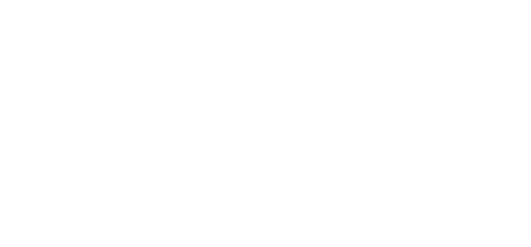
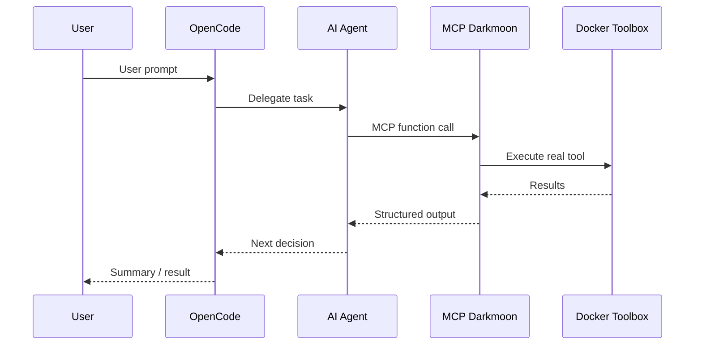

<div align="center">



**AI-Powered Autonomous Penetration Testing Platform**

[](https://www.gnu.org/licenses/gpl-3.0)
[](https://github.com/ASCIT31/darkmoon)

[Documentation](docs/full.md) • [Contributing](CONTRIBUTING.md) • [License](LICENSE)

</div>

---

## Why DarkMoon?

**DarkMoon is a French cybersecurity solution that automates complete penetration testing campaigns using AI agents.**

Traditional pentesting is:
- ⏱️ **Time-consuming** — manual testing takes weeks
- 💰 **Expensive** — expert consultants cost thousands per day
- 🔄 **Inconsistent** — results vary by tester expertise
- 📊 **Hard to scale** — limited by human resources

**DarkMoon solves this by:**
- 🤖 **Autonomous AI agents** that conduct full security assessments
- 🛡️ **Security by design** — AI never directly executes tools, only orchestrates through controlled MCP layer
- ♾️ **CI/CD** — Automated post-build penetration testing that detects critical vulnerabilities before production
- 🔧 **Comprehensive toolbox** — 50+ integrated security tools (Nuclei, NetExec, BloodHound, sqlmap, etc.)
- 📈 **Adaptive methodology** — specialized agents for Web, Active Directory, Kubernetes, Network, and more

Perfect for **all sectors** & **all companies size**.

---

## How To

### Prerequisites
- Docker & Docker Compose
- LLM API key (OpenRouter, Anthropic, OpenAI, or use local models)

### Quick Start

**1. Clone the repository**
```bash
git clone https://github.com/ASCIT31/darkmoon.git
cd darkmoon
```

**2. Configure your LLM**
```bash
# Edit docker-compose.yml with your API credentials
OPENROUTER_API_KEY=your-api-key-here
OPENCODE_MODEL=gpt-4o
```

**3. Launch DarkMoon**
```bash
./install.sh  # Clean install with full stack reset
```

**4. Run your first assessment**
```bash
./darkmoon.sh "TARGET: example.com"
```

**5. Monitor real-time progress**
```bash
./darkmoon.sh --log <session_id>
```

That's it! DarkMoon will:
1. 🔍 Discover the target environment
2. 🧠 Model the attack surface
3. 🎯 Deploy specialized agents (PHP, WordPress, GraphQL, AD, K8s, etc.)
4. 🔬 Execute evidence-based security testing
5. 📝 Generate a comprehensive audit report

---

## Example


<div align="center">

<video width="1024" height="640" controls>
  <source src="docs/pics/darkmoon_demo_fast.mp4" type="video/mp4">
</video>

**Real penetration test of a Juice Shop**
</div>

**Key capabilities demonstrated:**
- Multi-technology detection (Web + AD hybrid infrastructure)
- Reactive agent orchestration (GraphQL discovered mid-scan)
- Evidence-based findings (no false positives)
- Complete autonomous workflow (zero manual intervention)

### Architecture Highlights



**Security by design:** The AI never touches tools directly. All execution flows through a controlled MCP interface.

---

## License

This project is licensed under the **GNU General Public License v3.0**.

See [LICENSE](LICENSE) for details.

---

<div align="center">

**Built by ASC-IT with 💚 for All**

🔒 Data Sovereignty • 🤖 AI-Powered • 🇫🇷 Made in France

[⭐ Star us on GitHub](https://github.com/ASCIT31/darkmoon) • [📖 Full Documentation](docs/full.md)

</div>
