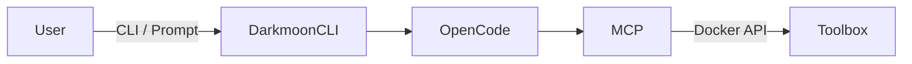
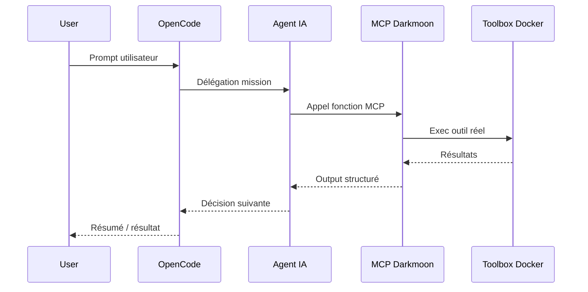
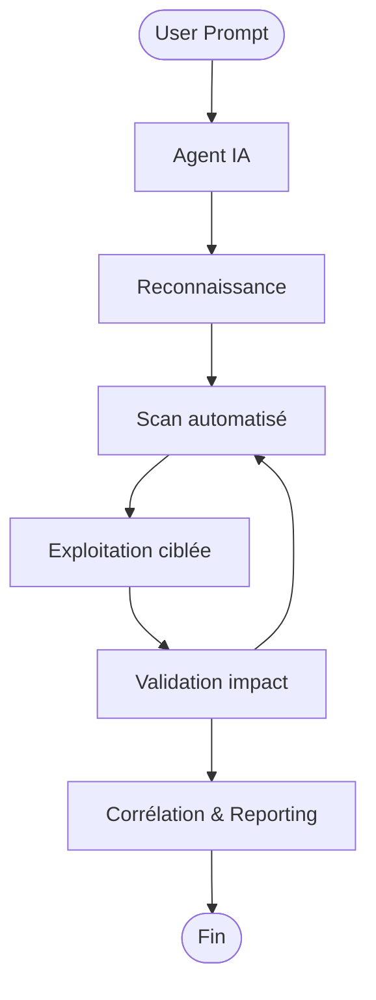

# 🏗️ Darkmoon — Architecture

Ce document décrit **l’architecture complète de Darkmoon**, ses composants, leurs interactions,
et les **choix techniques assumés**.

Public cible :

- architectes
- experts sécurité
- reviewers techniques
- contributeurs avancés

---

## 1. Vision architecturale

Darkmoon est conçu comme une **plateforme agentique distribuée**, où :

- l’IA **raisonne et orchestre**,
- les outils **s’exécutent réellement**,
- chaque frontière est **claire et maîtrisée**.

Principe fondamental :

> **L’IA ne touche jamais directement aux outils.**  
> Elle passe toujours par une couche contrôlée : le MCP.

---

## 2. Composants principaux

### 2.1 OpenCode (orchestrateur IA)

Rôle :

- gère les agents IA,
- dialogue avec le LLM,
- décide quelles actions exécuter,
- appelle le MCP.

Caractéristiques :

- LLM agnostique (Anthropic, OpenAI, Mistral, etc.)
- agents définis en **Markdown**
- configuration dynamique (`opencode.json`)

---

### 2.2 Agents IA (Markdown)

Rôle :

- définir la **stratégie offensive**,
- imposer des règles strictes (autonomie, non-interactivité),
- enchaîner les phases de pentest.

Caractéristiques :

- auditables (Markdown),
- versionnables (Git),
- modifiables sans rebuild,
- non destructifs par design.

---

### 2.3 MCP Darkmoon (FastMCP)

Rôle :

- exposer des **fonctions sécurisées** à l’IA,
- exécuter les outils **à sa place**,
- orchestrer les workflows.

Le MCP agit comme :

- une **API interne contrôlée**,
- une barrière de sécurité,
- un point d’extension.

---

### 2.4 Toolbox Darkmoon (Docker)

Rôle :

- contenir **les vrais outils de pentest**,
- garantir reproductibilité et isolation,
- fournir un environnement industriel.

Caractéristiques :

- image Docker dédiée,
- outils compilés une seule fois,
- runtime minimal,
- surface d’attaque réduite.

---

### 2.5 Docker & Volumes

Rôle :

- isoler les composants,
- persister la configuration,
- permettre la modification à chaud.

---

## 3. Diagramme de déploiement (Mermaid)

---

## 4. Diagramme de flux réseau

---

## 5. Diagramme d’activité — Pentest end-to-end

---

## 6. Frontières de sécurité (design clé)

Darkmoon impose **des frontières strictes** :

| Frontière      | Rôle                 |
| -------------- | -------------------- |
| Agent → MCP    | Contrôle des actions |
| MCP → Toolbox  | Exécution sécurisée  |
| Toolbox → Host | Isolation Docker     |

👉 L’IA :

- ne lance **jamais** de commandes système directement,
- ne gère **jamais** Docker elle-même,
- ne sort **jamais** de son périmètre.

---

## 7. Pourquoi FastMCP ?

FastMCP est utilisé car :

- protocole simple et explicite,
- facile à auditer,
- extensible,
- compatible avec l’approche agentique.

Il permet :

- l’exposition de fonctions métiers,
- la découverte dynamique de workflows,
- le contrôle strict des entrées/sorties.

---

## 8. Choix Docker multi-stage

Choix assumé :

- **build lourd**,
- **runtime minimal**.

Avantages :

- images plus petites,
- moins de dépendances,
- moins de surface d’attaque,
- comportement stable.

---

## 9. Pourquoi cette architecture est robuste

- séparation claire des responsabilités,
- aucune logique “magique”,
- chaque couche est remplaçable,
- aucun verrou fournisseur IA,
- adaptée aux environnements sensibles.

---

## 10. Résumé

Darkmoon est :

- modulaire,
- sécurisé,
- extensible,
- industriel.

Chaque composant :

- a un rôle unique,
- communique via des interfaces claires,
- peut évoluer sans casser l’ensemble.

---

➡️ Pour comprendre les agents :
voir `docs/agents.md`
